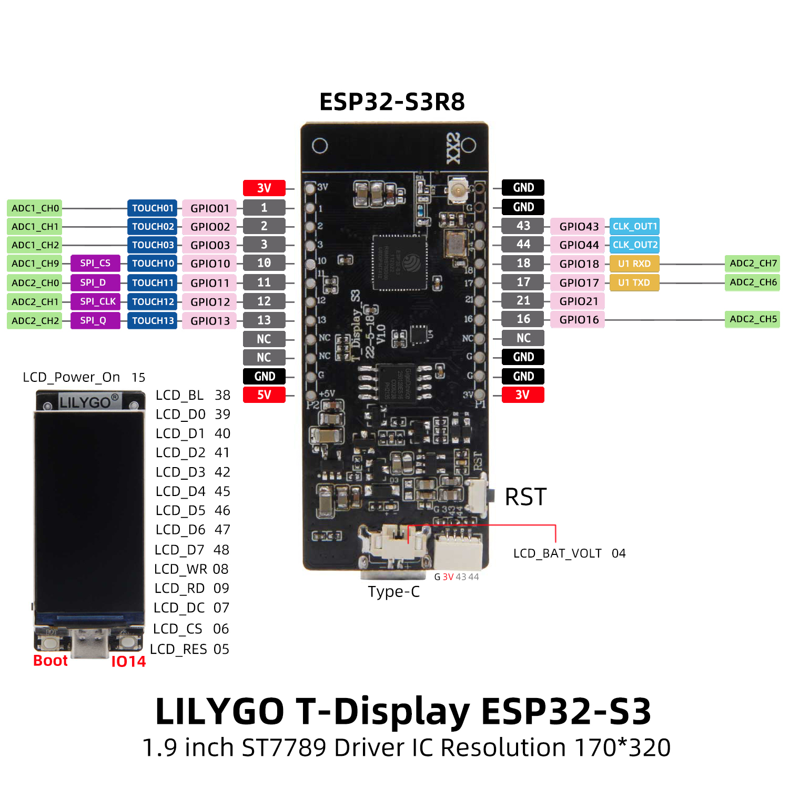

# T-Display-S3

This fork and document is designed to track the changes needed for support of the nostr signing device with the Lilygo ESP32 <a href="https://www.lilygo.cc/products/t-display-s3?variant=42284559827125">T-Display-S3</a> variant.

## Status - Working
- [WORKING] - Display 
- [WORKING] - Device pinouts updates
- [WORKING] - Communication with web installer
- [WORKING] - SPIFFS Storage
- [WORKING] - Sign a message payload (note1jzpsefqq39fxnqgcrktscn2d2fmlpng56zu5gusexl78c56982mq3qky9s)
 
## Troubleshooting
1) SPIFFS storage w/ ESP32-S3 does not mount correctly upon boot

	 ### Serial Output
	```
	E (552) SPIFFS: spiffs partition could not be found
	```
	Note: This error will appear in the serial monitor while the SPIFFS partition is originally created and formatted. This error should not appear again on subsequent reboots. 

	### Fix
	Use the proposed Arduino Configuration Settings below when flashing to an S3 device. The board partition, PSRAM, and flash settings need to be exact for this 

## Environment Tested
- Arduino IDE: 2.0.4
- esp32 by Espressif: 2.0.7

## Arduino Configuration Settings

| Setting                  | Value                            |
| :----------------------- | :------------------------------- |
| Board                    | ESP32S3 Dev Module               |
| USB CDC On Boot          | Enabled                          |
| CPU Frequency            | 240MHz (WiFi)                    |
| Core Debug Level         | None                             |
| USB DFU On Boot          | Enabled                          |
| Events Run On            | Core 1                           |
| Flash Mode               | QIO 80MHz                        |
| Flash Size               | 16MB (128Mb)                     |
| JTAG Adapter             | Integrated USB JTAG              |
| Arduino Runs On          | Core 1                           |
| USB Firmware MSC On Boot | Disabled                         |
| Partition Scheme         | Huge APP (3MB No OTA/1MB SPIFFS) |
| PSRAM                    | OPI PSRAM                        |
| USB Mode                 | Hardware CDC and JTAG            |

## T-Display-S3 Pinout

